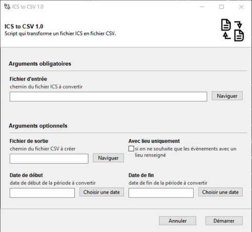

# ICS to CSV

Ce script permet de convertir un fichier ICS (format d'export du calendrier Google Agenda) en fichier CSV (fichier texte délimité). 

## Utilisation
`python ics_to_csv.py`

Cela ouvrira une interface graphique (générée par [Gooey](https://github.com/chriskiehl/Gooey)). 


### Arguments obligatoires
- Fichier d'entrée : un fichier CSV généré par Google Agenda. 
### Arguments optionnels
- Fichier de sortie : le chemin du fichier à sauvegarder. Par défaut : le même nom que le fichier d'entrée, mais avec l'extension CSV.
- Avec lieu uniquement : permet de ne sauvegarder que les enregistrements pour lesquels un lieu a été renseigné. 
- Date de début : permet de fitrer les évènements postérieurs à cette date (format `AAAA-MM-JJ`). 
- Date de fin : permet de filtrer les évènements antérieurs à cette date (format `AAAA-MM-JJ`)


## Utilisation en ligne de commande
Vous pouvez commenter la ligne de décorateur `@Gooey(...)` qui se trouve jsute au dessus de la fonction `main()` et le programme fonctionnera en ligne de commande : 
```
usage: ics_to_csv.py [-h] [--output-file Fichier de sortie] [--location-only] [--from-date Date de début]
                     [--to-date Date de fin]
                     Fichier d'entrée

Script qui transforme un fichier ICS en fichier CSV.

positional arguments:
  Fichier d'entrée      chemin du fichier ICS à convertir

optional arguments:
  -h, --help            show this help message and exit
  --output-file Fichier de sortie, -o Fichier de sortie
                        chemin du fichier CSV à créer
  --location-only, -l   si on ne souhaite que les évènements avec un lieu renseigné
  --from-date Date de début, -f Date de début
                        date de début de la période à convertir
  --to-date Date de fin, -t Date de fin
                        date de fin de la période à convertir
```
  

## Installation
Nécessite Python 3.9+. 
- Dans une ligne de commande, allez dans le répertoire de votre choix. 
Exemple : 
```
cd c:\Python
``` 
- Clonez le repo : 
```
git clone https://github.com/PhunkyBob/ics_to_csv.git
```
- Allez dans le répertoire qui vient d'être créé : 
```
cd ics_to_csv
```
- (optionnel, mais conseillé) Créez un environnement virtuel et activez le : 
```
python -m venv venv
.\env\Script\activate
```
- Installez les librairies nécessaires : 
```
pip install -r requirements.txt
```

### Exécutable
Vous pouvez essayer d'utiliser directement [la version binaire](https://github.com/PhunkyBob/ics_to_csv/releases) (expérimental).